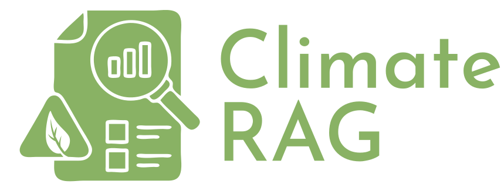
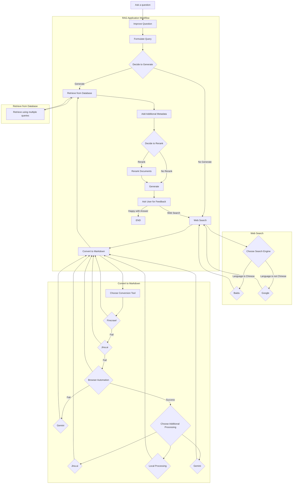

<div align="center">

</div>

# **Climate RAG:** Retrieval augmented generation pipeline to identify, scrape and ingest web documents to answer climate-related queries

## Features
* Supports multiple languages and will auto-translate into other languages to run optimal search
* Supports multiple search engines (eg. Baidu is better than Google for Chinese documents)
* Extracts information from websites, PDFs (including scanned PDFs!), local text and other sources...
* Modular design based on Langchain and Langraph supports multiple industry-standard LLMs including OpenAI GPT-4o, Google Gemini, Anthropic Claude, Meta Llama 3.1, Ollama (local LLMs)
* User-friendly proof of concept UI
* Command-line tools and python API to enable easy automation
* RAG process means LLM (almost) always cites the correct sources.




[climate-rag-ui.webm](https://github.com/user-attachments/assets/1910dec8-ef9b-4a8a-9e9f-684745049365)

## Installation

**Please note: this package is still under development. It has only been tested in a couple of settings so far!**

We use uv to manage packages.

```bash
pip install uv
```

Add all the relevant API keys to a .env file in the root directory.

```bash
cp .env.example .env
```

## API Keys

The following API keys are required or optional for Climate RAG to function:

| API Key                  | Description                                                                                                 | Required | Source                                                                                                        |
|--------------------------|-------------------------------------------------------------------------------------------------------------|----------|----------------------------------------------------------------------------------------------------------------|
| `OPENAI_API_KEY`         | Used for OpenAI embeddings and LLM (GPT-4, GPT-3.5)                                                    | Optional | [https://platform.openai.com/account/api-keys](https://platform.openai.com/account/api-keys)                     |
| `TAVILY_API_KEY`        | Used for Tavily Search                                                                                     | Optional | [https://www.tavily.com/](https://www.tavily.com/)                                                              |
| `LANGCHAIN_API_KEY`      | Used for LangChain tracing (optional)                                                                    | Optional | [https://docs.langchain.com/docs/integrations/providers/langchain_hub](https://docs.langchain.com/docs/integrations/providers/langchain_hub) |
| `FIRECRAWL_API_KEY`     | Used for FireCrawlLoader                                                                                    | Optional | [https://firecrawl.io/](https://firecrawl.io/)                                                                 |
| `SERPER_API_KEY`        | Used for Serper.dev, a Google Search API alternative                                                   | Optional | [https://serper.dev/](https://serper.dev/)                                                                    |
| `SERPAPI_API_KEY`       | Used for SerpApi, a Google Search API alternative                                                       | Optional | [https://serpapi.com/](https://serpapi.com/)                                                                   |
| `JINA_API_KEY`           | Used for Jina AI document reranking and loading PDF files                                               | Optional | [https://cloud.jina.ai/](https://cloud.jina.ai/)                                                               |
| `COHERE_API_KEY`         | Used for Cohere reranking                                                                                   | Optional | [https://cohere.ai/](https://cohere.ai/)                                                                       |
| `REDIS_HOSTNAME`        | Hostname of your Redis instance                                                                          | Required | [https://redis.io/](https://redis.io/)                                                                        |
| `REDIS_PORT`            | Port of your Redis instance                                                                            | Required | [https://redis.io/](https://redis.io/)                                                                        |
| `CHROMADB_HOSTNAME`      | Hostname of your ChromaDB instance                                                                       | Required | [https://docs.trychroma.com/](https://docs.trychroma.com/)                                                     |
| `CHROMADB_PORT`          | Port of your ChromaDB instance                                                                         | Required | [https://docs.trychroma.com/](https://docs.trychroma.com/)                                                     |
| `STATIC_PATH`           | Path to the static directory for serving output files (optional)                                         | Optional |                                                                                                                 |
| `UPLOAD_FILE_PATH`      | Path to the directory where uploaded files are stored (optional)                                         | Optional |                                                                                                                 |
| `S3_BUCKET`              | Name of your S3 bucket (optional)                                                                          | Optional | [https://aws.amazon.com/s3/](https://aws.amazon.com/s3/)                                                         |
| `S3_ACCESS_KEY_ID`       | Access key ID for your S3 bucket (optional)                                                                 | Optional | [https://aws.amazon.com/s3/](https://aws.amazon.com/s3/)                                                         |
| `S3_ACCESS_KEY_SECRET`   | Secret access key for your S3 bucket (optional)                                                             | Optional | [https://aws.amazon.com/s3/](https://aws.amazon.com/s3/)                                                         |
| `S3_ENDPOINT_URL`       | Endpoint URL for your S3-compatible storage service (e.g., MinIO) (optional)                              | Optional |                                                                                                                 |
| `USE_S3`                | Whether to use S3 for storing output files (optional, default: `False`)                                   | Optional |                                                                                                                 |
| `GOOGLE_APPLICATION_CREDENTIALS` | Path to your Google Cloud service account credentials file (required for using Gemini)                 | Optional | [https://cloud.google.com/docs/authentication/getting-started](https://cloud.google.com/docs/authentication/getting-started) |
| `GOOGLE_PROJECT_ID`     | ID of your Google Cloud project (required for using Gemini)                                                | Optional | [https://cloud.google.com/resource-manager/docs/creating-managing-projects](https://cloud.google.com/resource-manager/docs/creating-managing-projects) |


## Usage

### Running the RAG Pipeline

First, you will need to start a ChromaDB server:

```bash
uv run chroma run --path chroma/
```

Also ensure that you have a Redis Stack server running:

```bash
redis-cli ping
```


To run a query against the RAG pipeline, execute the following command, replacing `"Give me a list of coal power plants in Vietnam"` with your desired query:

```bash
uv run query_data.py "Give me a list of coal power plants in Vietnam"
```

See the [Advanced Options](#advanced-options) section for additional configuration options.


###  Running the WebApp

To launch the Climate RAG web app, run the following command:

```bash
uv run webapp.py
```

This will launch the app in your web browser. The web app provides a more user-friendly interface for interacting with the RAG pipeline. It features:

**Chat Interface**

* Ask questions in natural language.
* View the AI's responses and the sources used.
* Download the answers as PDF or DOCX files.

**Previous Queries**

* Access a history of your previous questions and answers.
* Download previous answers as PDF or DOCX files.

**Document Management**

* Upload new documents directly to the database.
* Add URLs for the pipeline to scrape and ingest.
* Search through existing documents in the database.
* View details of specific documents, including titles, company names, sources, dates added, and page lengths.

**Console**

* View the console logs for troubleshooting and monitoring the pipeline's activity.
###  Populate the Database

To populate the database with relevant documents, you can either provide a list of URLs, upload files directly, or ingest a directory of documents.

**Adding URLs**

To add new URLs to the database, run the following command, replacing `https://www.example.com` with the desired URL.  You can add multiple URLs by separating them with spaces:

```bash
uv run populate_database.py --urls "https://www.example.com" "https://www.another-example.com"
```

**Uploading Files**

To add local files to the database, run the following command, replacing `path/to/file1.pdf` with the desired file path.  You can add multiple files by separating them with spaces:

```bash
uv run populate_database.py --files "path/to/file1.pdf" "path/to/file2.md"
```

**Ingesting a Directory**

To ingest a directory of documents, put your files in the `data/` directory and then run the following command:

```bash
uv run populate_database.py
```


### Database Cleanup

To remove documents from the database, you can use the `cleanup_database.py` script. This script will identify and remove documents that contain certain error messages or have a page length shorter than a predefined threshold. To run the script:

```bash
uv run cleanup_database.py
```

###  Adding Additional Metadata

The RAG pipeline uses metadata to enhance document retrieval. You can manually add additional metadata to a document or enable automatic metadata extraction.

**Automatic Metadata Extraction**

To enable automatic metadata extraction, use the `--add-additional-metadata` flag when running the RAG pipeline. This will use a large language model to extract metadata from the documents in the database.

##  Advanced Options

The RAG pipeline offers various configuration options. You can customize the behavior using the following flags:

* **--rag-filter:** Filter the database search to specific sources (e.g., `--rag-filter carbontracker.org`).
* **--improve-question:** Improve the query using a language model before searching (default: `True`).
* **--rerank:** Rerank the retrieved documents using a ranking model (default: `True`).
* **--crawl:** Crawl the web for additional documents (default: `True`).
* **--language:** Select the language for the query (e.g., `--language zh` for Chinese).
* **--max-search-queries:** Set the maximum number of search queries (default: `1`).
* **--initial-generation:** Generate an answer before web search (default: `True`).
* **--llm:** Select the language model to use (default: `claude`).

For example, to run a query in Chinese with a maximum of 5 search queries, you would use the following command:

```bash
uv run query_data.py "给我一份关于越南煤电厂的清单" --language zh --max-search-queries 5
```
## Acknowledgements:
* [Pixegami](https://github.com/pixegami/rag-tutorial-v2) for initial RAG workflow
* [Greg Kamradt](https://www.youtube.com/watch?v=8OJC21T2SL4) for chunking strategies

##  Contributing

We welcome contributions to Climate RAG. If you'd like to contribute:

1. Fork the repository.
2. Create a new branch for your changes.
3. Make your changes and commit them with clear descriptions.
4. Push your changes to your forked repository.
5. Submit a pull request to the main repository.

